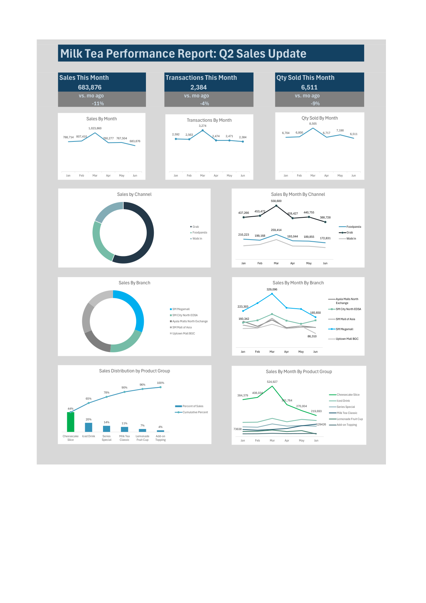

## Performance Report: Q2 Sales Update

### 1. Problem

* **Sales dipped:** Total sales softened to **683,876** this month, an **11% dip** from last month.

* **Volume slowed:** Total items sold adjusted downward by **9%** (6,511 units) and total transactions eased by **4%** (2,384).

### 2. Solution

* **Focus on the cake business:** Look closely at the recent dip in cheesecake sales, especially at our primary locations and delivery channels.

### 3. Benefit

* **Recover revenue:** Addressing the issues with this core product line will stop the downward trend and help bring overall sales back up.

### 4. Findings

* **The main driver:** Cheesecake slice sales dropped from a March peak of **524,927** down to **213,893** in June.

* **Where the dip occurred:** The lower numbers were concentrated mostly on the **Grab app** and at the **SM Megamall** branch. SM Megamall sales shifted from 329,090 in March to 185,650 in June.

* **Gains didn't offset losses:** While Milk Tea Classic sales grew from April to June, the steady progress there wasn't large enough to offset the lower cheesecake numbers.

### 5. Recommendations

* **Fuel growing categories:** Take advantage of the positive momentum of the Milk Tea Classic line. Introduce bundle promos on delivery apps (e.g., pairing a growing milk tea item with a cheesecake slice) to help pull up the slower product group.
* **Investigate delivery operations:** Audit the branch-level packing and dispatch process for app orders, focusing on order accuracy (customization compliance, missing items) and spill-proof packaging.
* **Audit product quality and supply chain:** Review store-level inventory handling, dairy holding temperatures, and transit shelf-life at high-volume locations like SM Megamall to rule out any consistency or freshness issues.
* **Gather frontline feedback:** Run structured interviews with store staff and delivery riders to identify common operational bottlenecks, customer complaints, or aggressive competitive moves in the area.

* 
* [Excel file](pearltea_transactions_github.xlsx).
